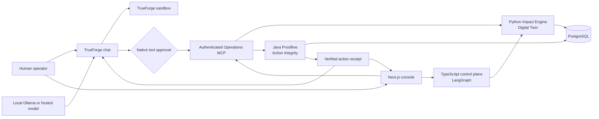

# RelayGrid

**An approval-gated physical AI control plane for warehouse robots, inventory, recalls and on-call incidents.**

RelayGrid is built for the **Runbook Executor** theme of the Agents That Act hackathon. Agents follow human-authored procedures, collect operational evidence, prepare a narrowly scoped action and pause for a person before changing warehouse state.

The project contains two connected workflows:

- **TraceHold** traces supplier recalls across inventory and orders, then prepares lot quarantine intents for review.
- **On-call Center** turns digital-twin anomalies into incidents, recalls verified past episodes, proposes a bounded remediation and verifies the result as `APPLIED`, `NOT_APPLIED` or `UNKNOWN`.

**Proofline** is the shared action-integrity layer. It records durable intents, enforces idempotency, claims approved execution and preserves an attributable outcome. Reconciliation reads receipts and current state without blindly repeating a physical mutation.

## What is included

- A Next.js operations console with a light glassmorphism interface
- A live 3D warehouse digital twin with robots, missions, zones, stock and anomalies
- A LangGraph control plane for bounded TraceHold analysis
- A deterministic Python impact and warehouse engine
- A Java Proofline action and approval ledger backed by PostgreSQL
- A TypeScript MCP server exposing narrow operational tools
- A TrueForge agent profile with approval gates on state-changing tools
- Human-authored TraceHold and warehouse incident runbooks
- Signed operator sessions for on-call mutations

## Quick start: functional demo

The demo is the fastest way to run RelayGrid from a fresh clone. It uses an in-memory warehouse and incident store, so Docker and Java are not required.

### Prerequisites

- Git
- Node.js **22.14 or newer**
- Python **3.12 or newer**
- `curl`

### Install and run

```sh
git clone https://github.com/code-anindya-X/relaygrid.git
cd relaygrid
./scripts/setup-local.sh --demo
./scripts/demo-up.sh
```

Open:

- RelayGrid Console: <http://localhost:5173>
- On-call Center: <http://localhost:5173/on-call>
- TrueForge: <http://localhost:8790>

Use `relaygrid-demo` to unlock the local On-call Center. The server exchanges it for a signed, `HttpOnly` operator session.

Demo mode starts the Console, impact engine, control plane, Operations MCP and TrueForge. It marks volatile on-call action records as `demo-memory`. TraceHold can analyze the built-in sample lots and show approval previews; durable inventory changes require the full stack.

Stop every process started by the scripts with:

```sh
./scripts/dev-down.sh
```

## Full durable stack

The full stack adds PostgreSQL and the Java Proofline service. Action intents, approvals, warehouse state, incident snapshots and attributable receipts are then persisted.

### Additional prerequisites

- Docker with Docker Compose
- Java 21

The Gradle wrapper is included and downloads the pinned Gradle distribution on first use; a system Gradle installation is not needed.

```sh
git clone https://github.com/code-anindya-X/relaygrid.git
cd relaygrid
./scripts/setup-local.sh --full
./scripts/dev-up.sh
```

`setup-local.sh` creates `.env` from `.env.example` when needed, installs JavaScript and Python dependencies, starts PostgreSQL and seeds `LOT-0001` and `LOT-0002`. `dev-up.sh` starts the application services and writes logs and PID files under `.local/`.

The values in `.env.example` are local development credentials. Before running RelayGrid on a shared machine, replace at least:

- `MCP_BEARER_TOKEN`
- `PROOFLINE_INTERNAL_TOKEN`
- `IMPACT_ENGINE_INTERNAL_TOKEN`
- `CONTROL_PLANE_INTERNAL_TOKEN`
- `CONSOLE_OPERATOR_ACCESS_CODE`
- `CONSOLE_SESSION_SECRET` with a random value of at least 32 characters

Production mutations fail closed when required service credentials are missing. Operator authentication also rejects missing, weak or demo credentials in production.

## Configure the TrueForge agent

Both startup modes launch TrueForge and attempt an idempotent bootstrap. The bootstrap always registers the authenticated RelayGrid Operations MCP connector. It creates the `relaygrid-operator` agent only after a model can be selected.

### No-key local harness

With Ollama running, provision the local Qwen model and RelayGrid agent without an external API key:

```sh
npm run trueforge:local
npm run verify:trueforge
```

Before presenting the full durable workflow, use the combined gate:

```sh
npm run demo:ready
```

The setup is idempotent: it downloads `qwen3:8b` only when absent, registers the OpenAI-compatible Ollama endpoint, authenticates the RelayGrid MCP connector, and creates or updates `relaygrid-operator`.

### External model provider

1. Open <http://localhost:8790> and configure a model in **Settings → Models**.
2. If exactly one model exists, run the bootstrap directly. If several exist, first set `TRUEFORGE_MODEL_NAME` in `.env` to the exact model name.
3. Run:

   ```sh
   npm run trueforge:bootstrap
   ```

The bootstrap is safe to run repeatedly. For a hosted TrueForge instance, set `TRUEFORGE_URL`, `TRUEFORGE_API_TOKEN` when authentication is enabled, and `OPS_MCP_PUBLIC_URL` to an HTTPS URL that the hosted service can reach. The full integration guide is in [`docs/trueforge-local.md`](docs/trueforge-local.md).

## TrueForge harness contract

TrueForge is the decision and safety harness, not a decorative chat layer. The checked-in agent manifest and bootstrap enforce the following runtime contract:

| Harness capability | RelayGrid implementation |
| --- | --- |
| Agent runtime | `relaygrid-operator` with bounded instructions and a 60-iteration limit |
| Real-system reach | Authenticated `relaygrid-operations` MCP connector |
| Tool surface | 14 purpose-built tools; generic mutation tools are excluded |
| Fast grounding | 6 read-only schemas preloaded before the first model turn |
| Generated code safety | TrueForge sandbox enabled with operational credentials kept outside generated code |
| Human control | `quarantine_lot` and `execute_incident_remediation` require native TrueForge approval |
| Concurrency safety | Parallel tool calls disabled for deterministic action sequencing |
| Durable authorization | Proofline validates the approved action ID and exact target before mutation |
| Outcome integrity | Results persist as `APPLIED`, `NOT_APPLIED`, or `UNKNOWN`; unknown writes are never blindly retried |

Run `npm run verify:trueforge` to assert this exact contract against the live TrueForge API. The judge-facing walkthrough and prompts are in [`docs/trueforge-harness-demo.md`](docs/trueforge-harness-demo.md).

## Architecture



| Component | Language | Responsibility | Port |
| --- | --- | --- | --- |
| `apps/console` | TypeScript / Next.js | Command center, digital twin, incident response and operator review | `5173` |
| `services/control-plane-ts` | TypeScript / LangGraph | TraceHold workflow and credential-protected lifecycle routing | `8084` |
| `services/impact-engine-py` | Python / FastAPI | Deterministic impact analysis, warehouse state, incident memory and action receipts | `8002` |
| `services/proofline-java` | Java / Spring Boot | Durable intent, approval, idempotency and outcome ledger | `8082` |
| `services/ops-mcp-ts` | TypeScript / MCP | Read tools, intent preparation and approved operational actions | `8083` |
| TrueForge | TypeScript | Agent runtime, MCP connection and human tool approvals | `8790` |
| PostgreSQL | SQL | Durable inventory, incident and Proofline records | `5432` |

## Console routes

| Route | Purpose |
| --- | --- |
| `/` | Command center and live service overview |
| `/on-call` | Incident evidence, memory, remediation, approval and verification |
| `/warehouse` | 3D warehouse digital twin and robot controls |
| `/runbooks/tracehold` | Supplier recall intake and impact analysis |
| `/admin` | Proofline action review and history |
| `/agents` | Agent mesh, MCP connection and service architecture |

## Operations MCP tools

RelayGrid exposes 14 purpose-built tools. The two execution tools require explicit TrueForge approval.

### Warehouse and TraceHold

- `get_tracehold_runbook`
- `warehouse_snapshot`
- `fleet_status`
- `digital_twin_state`
- `inventory_get_lots`
- `orders_for_lots`
- `prepare_quarantine`
- `quarantine_lot` — state changing, approval required

### On-call response

- `get_oncall_runbook`
- `oncall_status`
- `incident_context`
- `incident_memory`
- `prepare_incident_remediation`
- `execute_incident_remediation` — state changing, approval required

The On-call runbook follows:

```text
Detect → Recall → Investigate → Prepare intent → Human approval → Execute → Verify → Resolve → Learn
```

A repeated execution request for the same incident intent performs verification-only reconciliation. It does not repeat the warehouse mutation.

## Verify a local start

After `demo-up.sh` or `dev-up.sh`, these endpoints should respond successfully:

```sh
curl -fsS http://127.0.0.1:8002/health
curl -fsS http://127.0.0.1:8084/health
curl -fsS http://127.0.0.1:8083/health
curl -fsS http://localhost:8790/healthz
curl -fsS -o /dev/null http://localhost:5173
```

For the full stack, Proofline should also be healthy:

```sh
curl -fsS http://127.0.0.1:8082/v1/actions/health
```

Before presenting, run the strict hackathon readiness gate:

```sh
npm run verify:hackathon
```

It verifies every service, PostgreSQL durability, an end-to-end TraceHold approval preview, and the presence of a configured TrueForge model and agent. Use `npm run verify:hackathon -- --services-only` while the model is still being configured.

Optional build checks:

```sh
npm --prefix apps/console run build
npm --prefix services/control-plane-ts run build
npm --prefix services/ops-mcp-ts run build
services/impact-engine-py/.venv/bin/python -m py_compile services/impact-engine-py/app/main.py
(cd services/proofline-java && ./gradlew build)
```

## Troubleshooting

- **A service does not start:** inspect `.local/logs/<service-name>.log`. The startup script prints the exact log path for each process.
- **Dependencies are reported missing:** rerun `./scripts/setup-local.sh --demo` or `./scripts/setup-local.sh --full`, matching the mode you want to start.
- **TrueForge registers MCP but no agent appears:** configure a model, set `TRUEFORGE_MODEL_NAME` when more than one model exists, then rerun `npm run trueforge:bootstrap`.
- **PostgreSQL is not ready:** run `docker compose logs postgres`; the full setup waits up to 30 seconds for readiness.
- **A previous local run is still using the ports:** run `./scripts/dev-down.sh`, then start the selected mode again.
- **The first Proofline start is slow:** the included Gradle wrapper may still be downloading Gradle and Java dependencies.

## Repository layout

```text
apps/console/                  Next.js operator console
services/control-plane-ts/    LangGraph orchestration and lifecycle API
services/impact-engine-py/    Deterministic warehouse and incident engine
services/proofline-java/      Durable action integrity service
services/ops-mcp-ts/          Operations MCP server
runbooks/                     Human-authored execution procedures
config/trueforge/             RelayGrid agent profile and instructions
infra/postgres/               Database schema and local demo seed
scripts/                      Setup, start and stop commands
```

## Scope

The repository ships with simulated warehouse data and local development credentials. Connecting a real warehouse management system, robot fleet or identity provider requires deployment-specific adapters, credentials and authorization policies.

## AI-assisted development

GitHub Copilot was used during development for implementation support, debugging, and documentation. The team reviewed the generated changes and is responsible for the architecture, code, and demo.

## AWS deployment

The fastest hosted demo path uses a single EC2 instance with only the Console exposed publicly. See [`infra/aws/README.md`](infra/aws/README.md) for the instance settings and reproducible user-data bootstrap.
