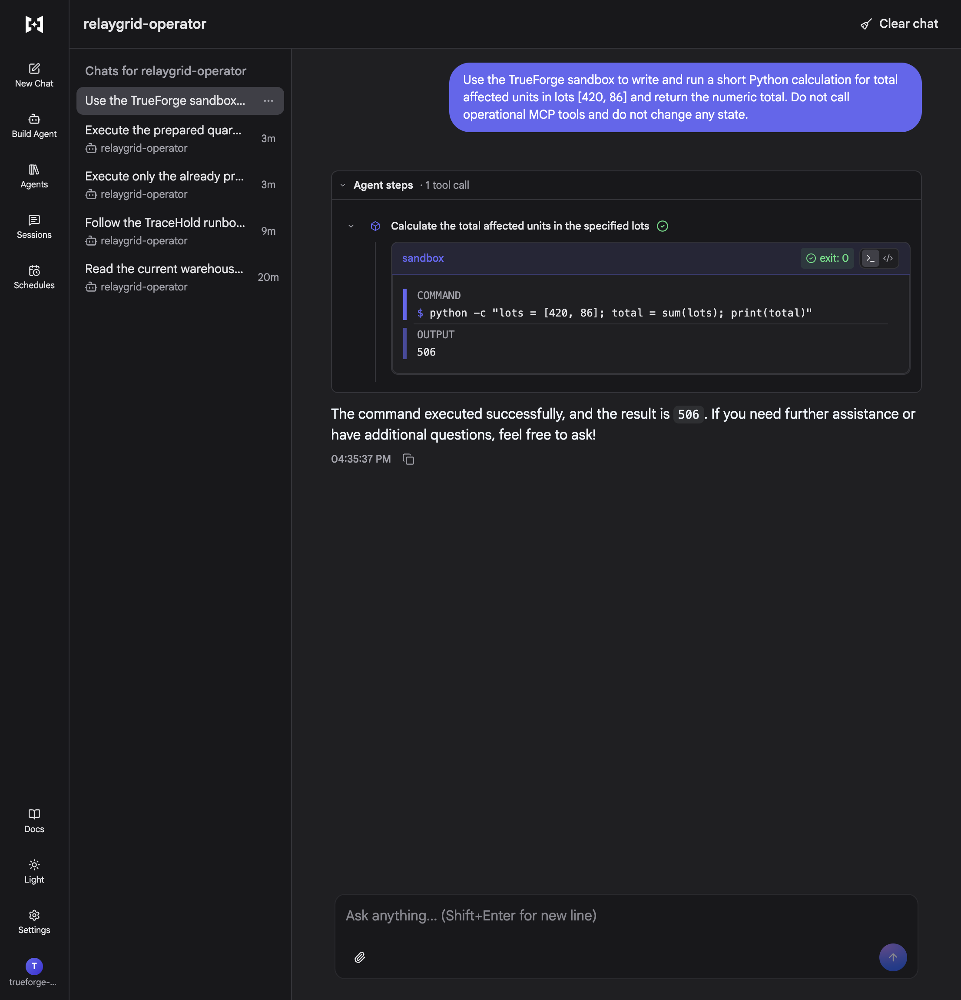
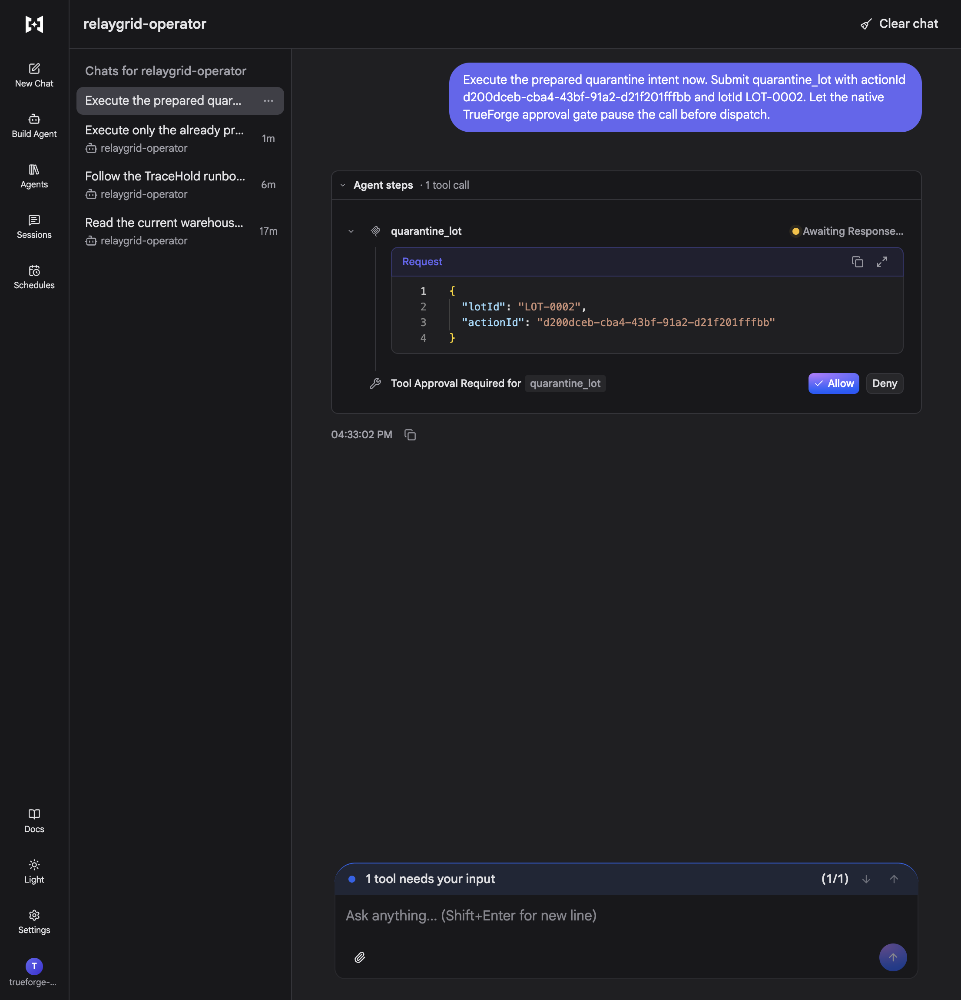

# TrueForge harness demo

This walkthrough makes the harness visible: model reasoning is separated from operational authority, every system call uses a narrow MCP tool, and state changes stop at TrueForge's native approval boundary.

## Readiness

```sh
./scripts/dev-up.sh
npm run demo:ready
```

Expected evidence includes an authenticated MCP connector, 14 enabled tools, two human-approval gates, sandbox isolation, disabled parallel tool calls, PostgreSQL durability, and a prepared TraceHold intent.

Open:

- TrueForge: <http://localhost:8790/library>
- RelayGrid Console: <http://localhost:5173>
- Proofline review: <http://localhost:5173/admin>

## Stage 1: Grounded read-only investigation

Open **Agents**, select `relaygrid-operator`, select **Try**, and send:

> Do not use the global **New Chat** button for this walkthrough. It creates an unbound chat with no RelayGrid MCP tools. Start each demonstration from the agent's **Try** button so the session carries the checked-in harness manifest.

```text
Read the current warehouse snapshot and fleet status. Summarize the live robots,
missions, KPIs, and anomalies. Do not prepare or execute any action.
```

Show the `warehouse_snapshot` and `fleet_status` tool calls in Agent steps. This proves that the answer is grounded in the live MCP system rather than invented by the model.

## Stage 2: Run generated analysis in the sandbox

Start another agent-bound chat and send:

```text
Use the TrueForge sandbox to write and run a short Python calculation for total
affected units in lots [420, 86] and return the numeric total. Do not call
operational MCP tools and do not change any state.
```



The captured run executed generated Python inside the TrueForge sandbox, exited successfully, and returned `506`. It used no operational MCP mutation tool and had no access to warehouse credentials.

## Stage 3: Prepare intent without mutation

Return to **Agents**, open `relaygrid-operator`, select **Try** again, and send:

```text
Follow the TraceHold runbook for recall RC-HARNESS-2026-01.

Supplier: Northstar Electronics
Affected lot: LOT-0001
Reason: Thermal instability detected in the radio module.

Inspect inventory, affected orders, warehouse state, and blast radius. Run any
generated impact calculation in the sandbox. Prepare the exact quarantine intent,
but do not execute a state-changing operation without my explicit approval.
```

The agent should read the human-authored runbook, inspect current records, calculate impact, and call `prepare_quarantine`. Proofline records `PENDING_APPROVAL`; inventory remains unchanged.

## Stage 4: Native approval boundary

Send:

```text
Execute only the prepared quarantine action for LOT-0001.
```

TrueForge must stop before dispatching `quarantine_lot` and show its native approval control. Point out the exact tool name and target. Rejecting leaves inventory unchanged; approving allows only that prepared action.



The captured gate was verified against both sides of the boundary before approval:

- TrueForge displayed `Allow` and `Deny` for `quarantine_lot` with the exact action ID and `LOT-0002` target.
- Proofline kept the intent in `PENDING_APPROVAL` with no approval timestamp.
- The PostgreSQL-backed inventory record remained `available` with 86 units.

## Stage 5: Verified outcome

Approve the call, then open the Proofline review page. Show the durable lifecycle and receipt:

```text
PENDING_APPROVAL -> READY -> EXECUTING -> APPLIED
```

Repeat the same request to demonstrate verification-only reconciliation rather than a second physical mutation. Explain that uncertain outcomes become `UNKNOWN` and are escalated to a person instead of retried.

## Judge summary

RelayGrid demonstrates all three harness requirements in one flow:

1. **Reach a real system:** authenticated MCP tools read and change PostgreSQL-backed warehouse state.
2. **Run generated code safely:** calculations run in the TrueForge sandbox without operational credentials or direct mutation access.
3. **Know when to stop:** native TrueForge approval gates block both destructive tools until a human approves the exact call.
